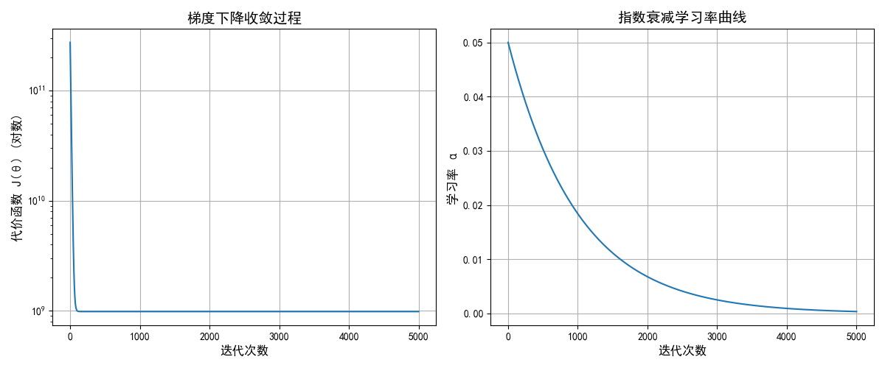

# 多变量线性回归 (Linear Regression with Multiple Variables)

多变量线性回归用于预测一个连续变量（目标）与多个特征（自变量）之间的线性关系。它是机器学习中基础的回归方法之一，能够捕捉多个因素对目标变量的综合影响。

[上一章](./LinearRegressionWithOneVariable.md) --- [下一章]()

---

这部分结合一个房价随房子大小和房子距离学校距离远近的[数据集](./dateSet/priceBymultiLinear-dataset.csv)来理解，
数据都是由grok生成，类似这样;和单变量线性回归中相似的定义不再做通俗解释。

|房子大小 (平方米)|楼层|年限 (年)|距学校距离 (公里)|房价 (元)|
|-----------   |---|--------|-------|-------|
|106.18|7|26.5|1.5|677784.0|
|192.61|17|12.1|3.0|1224394.0|
|159.8|20|4.7|0.25|1087393.0|
|139.8|4|44.9|0.28|753724.0|
|73.4|5|45.0|4.13|470202.0|
|73.4|7|31.7|1.86|434783.0|

---

## 1.多维特征

在之前的房价预测问题里，只考虑到房屋尺寸一个特征，这里我们考虑多个特征的问题。
比如在房价预测问题中，引入房间数、楼层、年限等。
此时的模型：
$$h_\theta(x) = \theta_0 + \theta_1 x_1 + \theta_2 x_2 + \dots + \theta_n x_n$$
上述公式中有 n+1 个参数和 n 个变量，为了简化公式，引入 x0 = 1，则上式写作：
$$h_\theta(x) = \theta_0 x_0 + \theta_1 x_1 + \theta_2 x_2 + \dots + \theta_n x_n$$
如此改写向量形式(其中，T 代表矩阵转置)：
$$h_\theta(x) = \theta^T X$$

然后在这样一个多变量线性回归中，我们也构建一个代价函数，则这个代价函数是所有建模误差的平方和，
用来衡量模型预测值与真实值之间的误差，定义为：

$$
J(\theta_0,\theta_1...\theta_n) = \frac{1}{2m} \sum_{i=1}^{m} \Big( h_\theta(x^{(i)}) - y^{(i)} \Big)^2
$$

其中：
- $ m $ 为训练样本数量
- $ h_\theta(x^{(i)}) $ 为第 $ i $ 个样本的预测值
- $ y^{(i)} $ 为第 $ i $ 个样本的真实值

也可以准备一个python代码来计算代价函数：
```python
def compute_cost(X, y, theta):
    inner = np.power(((X * theta.T) - y), 2)
    return np.sum(inner) / (2 * len(X))
```

## 2.多变量梯度下降
多变量梯度下降的目标和单变量线性回归问题中一样，要找出使得代价函数最小的一系列参数。

梯度下降的核心思想是：  
- **梯度（gradient）**：$\nabla J(\theta)$ 指向函数增长最快的方向  
- **最小化目标**：我们要往反方向走，逐步降低 $J(\theta)$  

因此每一步更新公式为：

$$
\theta_j := \theta_j - \alpha \cdot \frac{\partial}{\partial \theta_j} J(\theta_0,\theta_1...\theta_n)
$$

这里：
- $\alpha$ 是学习率 (learning rate)，决定步长  
- $\frac{\partial}{\partial \theta_j} J(\theta)$ 是代价函数对参数 $\theta_j$ 的偏导，表示 $J(\theta)$ 对该参数的敏感程度  

对 $\theta_j$ 求偏导：

$$
\frac{\partial}{\partial \theta_j} J(\theta) 
= \frac{1}{2m} \cdot 2 \sum_{i=1}^{m} \Big( \theta^T x^{(i)} - y^{(i)} \Big) \cdot x_j^{(i)}
$$

化简得：

$$
\frac{\partial}{\partial \theta_j} J(\theta) 
= \frac{1}{m} \sum_{i=1}^{m} \Big( h_\theta(x^{(i)}) - y^{(i)} \Big) x_j^{(i)}
$$

代入梯度下降更新规则：

$$
\theta_j := \theta_j - \alpha \cdot \frac{1}{m} \sum_{i=1}^{m} \Big( h_\theta(x^{(i)}) - y^{(i)} \Big) x_j^{(i)}, 
\quad j=0,1,\dots,n
$$

这样我得到了两个公式：

1. 核心公式（通用形式）

> $$
\theta_j := \theta_j - \alpha \cdot \frac{\partial}{\partial \theta_j} J(\theta_0,\theta_1...\theta_n)
$$

特点：抽象、通用

适用场景：

- 任何机器学习模型的梯度下降更新都可以用这个公式

- 不依赖具体的代价函数，只要能算出偏导就能用

优点：概念清晰，方便推导不同模型的梯度

例子：线性回归、逻辑回归、神经网络等任何梯度下降都用这个公式开始

2. 最终公式（线性回归专用）

> $$
\theta_j := \theta_j - \alpha \cdot \frac{1}{m} \sum_{i=1}^{m} \Big( h_\theta(x^{(i)}) - y^{(i)} \Big) x_j^{(i)}, 
\quad j=0,1,\dots,n
$$

特点：具体、线性回归专用

适用场景：

- 已知代价函数是线性回归的均方误差

- 直接在代码里实现梯度更新

优点：不用再求偏导，直接写代码即可


_？ 那么新的问题，为什么要求偏导，通用公式不好吗 ？_

核心公式本身是抽象的通用形式，它本身无法直接计算数值更新，所以必须求偏导才能用在具体模型里。
因此实际训练模型时都是用最终公式，而且对线性回归、逻辑回归等常用模型，最终公式直接向量化后计算非常快，
核心公式不能直接向量化，需要先求偏导

---

## 3.特征和多项式回归

### 1.特征（Feature）

- **概念**：模型用来预测目标 \(y\) 的输入信息。  
- **产生背景**：
  - 数据复杂，一个结果可能受多个因素影响。
  - 为了让模型“看懂”这些因素，把它们抽象为特征。
- **例子**：
  - 房价预测：面积、楼层、位置 → 都是特征  
  - 学生成绩预测：上课时间、作业量、睡眠时间 → 特征  

**多特征线性回归公式**：

$$
h_\theta(x) = \theta_0 + \theta_1 x_1 + \theta_2 x_2 + \dots + \theta_n x_n
$$

- 特征越多，模型信息越丰富，预测能力可能越强  
- 但过多或不相关特征会造成**过拟合**
> 过拟合：模型太复杂，学到了训练数据里的噪声，而不是数据的真实规律。
从而导致模型在训练数据上表现很好，但在新数据（测试集）上表现差。
> 通俗理解：过拟合就像考试时只记住了老师讲的例题，而不会理解方法，遇到新题就不会做。

> 特征缩放（Feature Scaling）
> 概念：把特征的数值尺度统一到相近范围，常用方法：
> - 归一化（Min-Max Scaling）：把数据缩放到 [0,1]
> - 标准化（Standardization）：使数据均值为 0，方差为 1
> 
> 为什么要做： 
> 梯度下降收敛更快,避免某些大尺度特征主导梯度更新 
> 
> 例子： 
> 面积在 100200 平方米，价格在 10100 万 ,
> 不缩放时，梯度下降更新主要受价格影响，模型难训练

---

### 2️.多项式回归（Polynomial Regression）

- **概念**：为拟合非线性数据，把原特征进行升阶扩展，然后用线性回归拟合。  
- **产生背景**：
  - 数据呈曲线关系，直线无法拟合  
  - 希望保留线性回归求解简单、梯度下降可用的优点  
- **方法**：
  - 对原特征 \(x\) 扩展成 \(x^2, x^3, …, x^d\)  
  - 将这些新特征加入模型，形成多项式特征向量 \(x_{\text{poly}}\)  

**多项式回归公式**：

$$
h_\theta(x) = \theta_0 + \theta_1 x + \theta_2 x^2 + \dots + \theta_d x^d
$$

- 参数 $\theta_j$ 对应每个特征线性  
- 图像可以是曲线，但模型仍是线性回归（参数线性）

---

### 3.特征扩展示意(解释2中如何拟合非线性数据)

### 1️.原始特征
- 假设只有一个特征 $x$
- 数据向量形式：
$$
x = [x_1, x_2, ..., x_m]
$$
每个$x_i$是一个样本的特征值

### 2️.为什么要扩展
- 数据呈非线性关系时，单个特征无法拟合曲线  
- 希望线性模型也能拟合曲线 → 就把特征升阶，形成多项式特征

### 3️.扩展后特征
- 例如 2 阶多项式：
$$
x_{\text{poly}} = [1, x, x^2]
$$
  - 1 → 截距项  
  - x → 原始特征  
  - x² → 升阶特征  

- 每个样本从 1 个特征变成 3 个特征

### 4️.作用
- 模型仍是线性回归（参数线性）  
- 有 $x^2$ 这个特征后，拟合出的曲线可以弯曲  
- 训练时梯度下降会为每个特征学习一个权重 $\theta_j$

### 🔹 通俗比喻
- 原始特征 $x$ → 只有一条线索  
- 扩展特征 $x, x^2, x^3$ → 给模型更多“视角”，可以理解曲线趋势  
- 模型用每条线索的权重 $\theta_j$ 来综合判断，拟合出曲线  

### 🔹 总结
> “特征扩展示意”就是展示如何把原始特征通过升阶或变换，变成更多可用特征，让线性模型可以拟合非线性数据。

> 这里我看到时有疑问：多项式回归中，为什么采用平凡、立方这些方法来拟合非线性数据，这样不会导致数据异常吗
> 
> 幂次特征是为了让线性模型拟合曲线关系，虽然数值可能变大，但通过优化代价函数对应的 $\theta$会抵消这种放大效应，保证模型输出合理。

---

## 4.正规方程 Normal Equations

### 1️.背景

在线性回归中，我们希望找到最优参数 $\theta$，使代价函数最小：

$$
J(\theta) = \frac{1}{2m} \sum_{i=1}^m (h_\theta(x^{(i)}) - y^{(i)})^2
$$

- **梯度下降**方法需要迭代更新 $\theta$，选择学习率 $\alpha$，收敛速度受特征尺度影响。  
- **正规方程**提供一种**直接求解最优 $\theta$ 的方法**，无需迭代。

### 2️.正规方程公式

假设：

- $X$ 是特征矩阵（每行是一个样本，每列是一个特征，第一列全是 1 对应 $\theta_0$）  
- $y$ 是目标向量  

**公式**：

$$
\theta = (X^T X)^{-1} X^T y
$$

- $X^T$ → 矩阵转置  
- $(X^T X)^{-1}$ → 逆矩阵  
- 计算结果 $\theta$ 就是最小化代价函数的参数

### 3️.为什么要正规方程

1. **直接求解析解**：不需要迭代，梯度下降可能需要很多步才能收敛。  
2. **对特征尺度不敏感**：不必做特征缩放。  
3. **适合小规模问题**：当特征数量不多时，求逆矩阵开销可以接受。

### 4️.正规方程的推导思路

### 线性回归预测

假设有 $m$ 个样本，$n$ 个特征：

$$
h_\theta(X) = X \theta
$$

其中：

- $X$：$m \times (n+1)$ 的特征矩阵  

$$
X = 
\begin{bmatrix}
1 & x_1^{(1)} & x_2^{(1)} & \dots & x_n^{(1)} \\
1 & x_1^{(2)} & x_2^{(2)} & \dots & x_n^{(2)} \\
\vdots & \vdots & \vdots & \ddots & \vdots \\
1 & x_1^{(m)} & x_2^{(m)} & \dots & x_n^{(m)} \\
\end{bmatrix}_{m \times (n+1)}
$$
- $\theta$：$(n+1) \times 1$ 的参数向量  

$$
\theta = 
\begin{bmatrix}
\theta_0 \\
\theta_1 \\
\theta_2 \\
\vdots \\
\theta_n
\end{bmatrix}_{(n+1) \times 1}
$$

- $y$：真实的目标值向量，$m \times 1$ 的目标向量

$$
y = 
\begin{bmatrix}
y^{(1)} \\
y^{(2)} \\
y^{(3)} \\
\vdots \\
y^{(m)}
\end{bmatrix}_{m \times 1}
$$

- $h_\theta(X)$：模型的预测值

如此得到误差向量 $e$ = $ h_\theta(X) $ - $y$

### 代价函数（向量形式）

$$
J(\theta) = \frac{1}{2m} e^T e
= \frac{1}{2m} (h_\theta(X) - y)^T (h_\theta(X) - y)
$$

- 因为 $h_\theta(X) = X \theta$，所以可以写成：

$$
J(\theta) = \frac{1}{2m} (X \theta - y)^T (X \theta - y)
$$

最小值条件

- 代价函数是凸函数（二次形式），最小点满足梯度为 0  

$$
\frac{\partial J(\theta)}{\partial \theta} = 0
$$

向量偏导

对代价函数求导得到：

$$
\frac{\partial J(\theta)}{\partial \theta} = \frac{1}{m} X^T (X \theta - y)
$$

- 令导数为 0：

$$
X^T (X \theta - y) = 0
$$

解出 $\theta$，整理方程：

$$
X^T X \theta = X^T y
$$

假设 $X^T X$ 可逆：

$$
\theta = (X^T X)^{-1} X^T y
$$

> 这里为什么会假设可逆？
>
> - 正规方程的解需要求逆矩阵 $(X^T X)^{-1}$  
> - 如果 $X^T X$ 不可逆（奇异矩阵），就无法直接求逆  
> - 不可逆的原因通常是：
>  1. 特征之间**完全线性相关**（多重共线性）  
>  2. 特征数 $n+1$ 大于样本数 $m$  
>
>- 解决方法：
>  - 移除冗余特征  
>  - 使用**正则化**（如岭回归）保证矩阵可逆

### 正规方程最终形式

正规方程直接给出最优参数 $\theta$：

> $$
\theta = (X^T X)^{-1} X^T y
$$

- $X$：$m \times (n+1)$ 特征矩阵（第一列全为 1）  
- $y$：$m \times 1$ 目标向量  
- $\theta$：$(n+1) \times 1$ 最优参数向量  

> 直观理解：通过矩阵运算直接找到最小误差点，不需要迭代。


## 4. [Python 示例](./example/trainingMutiULR.py)

采用grok生成的[数据集](./dateSet/priceBymultiLinear-dataset.csv)，类似这样;

|Size_sqm|floor|age_years|Distance_km| Price_wan |
|-----------   |---|--------|-------|-----------|
|106.18|7|26.5|1.5| 677784.0  |
|192.61|17|12.1|3.0| 1224394.0 |
|159.8|20|4.7|0.25| 1087393.0 |
|139.8|4|44.9|0.28| 753724.0  |
|73.4|5|45.0|4.13| 470202.0  |
|73.4|7|31.7|1.86| 434783.0  |

- **目标**：利用多变量特征 `Size_sqm`、`floor`、`age_years`、`Distance_km` 来预测房价 `Price_wan`  
- **方法**：
  1. 读取 CSV 数据集  
  2. 构建特征矩阵 `X` 和目标向量 `y`  
  3. 使用 `scikit-learn` 的 `LinearRegression` 或自定义正规方程训练模型  
  4. 输出模型参数和预测结果  

我打算在代码里实现梯度下降和正规方程两种方式来最对比，
但是一开始梯度下降这样写的方法
```python
def gradient_descent(X, y, lr=0.01, n_iter=1000):
    m, n = X.shape
    theta = np.zeros((n, 1))
    for iteration in range(n_iter):
        gradient = (1/m) * X.T @ (X @ theta - y)
        theta -= lr * gradient
    return theta
```
里面的lr便是$\alpha$,由于我的的固定取值便导致了这样的输出，
```
梯度下降 theta: [nan nan nan nan nan]
```
这是可能的原因
- 1.学习率太大
- 2.数据没有标准化/归一化
- 3.迭代次数多、累计误差

如果学习率过大 + 迭代次数高，很快就溢出了。

所以这里要对$\alpha$初始值调整，然后随迭代次数减小，
常见的调整方法有：
- 固定衰减（随迭代次数 1/k 缩小）:lr = lr0 / (1 + decay * iteration)
- 指数衰减：lr = lr0 * (decay ** iteration)
- 分段衰减： 每隔 N 步把 lr 减小一半。
改进的代码：
```python
def gradient_descent(X, y, lr0=0.1, decay=0.001, n_iter=1000):
    m, n = X.shape
    theta = np.zeros((n, 1))
    for iteration in range(n_iter):
        # 学习率随迭代次数减小
        lr = lr0 / (1 + decay * iteration)
        gradient = (1/m) * X.T @ (X @ theta - y)
        theta -= lr * gradient
    return theta
```
最终跑下来看一下，我准备的这样的小模型，这样两个方法用时对比差距就很大了
```
=== 模型参数对比 ===
正规方程 theta: [104126.0251   4974.0859   9852.9724  -2028.9417  -2316.3184]
梯度下降 theta: [743186.75   220849.0929  61946.6021 -29235.5483  -3299.1717]

=== 用时对比 ===
正规方程用时: 0.000060 秒
梯度下降用时: 0.039314 秒
```

本来想输出一个学习率变化的图来直观感受一下，
但是在 数据量小、迭代次数多 的场景下，decay=0.001 其实下降得太快了，
把 decay 调小了很多（从原来的 0.001 → 0.0001），一些代码修改后。
现在输出的学习率曲线就可以很明显的看出来了，但是代价函数下降的依旧太快了，
<div align="center">
    
</div>

[上一章](./LinearRegressionWithOneVariable.md) --- [下一章]()