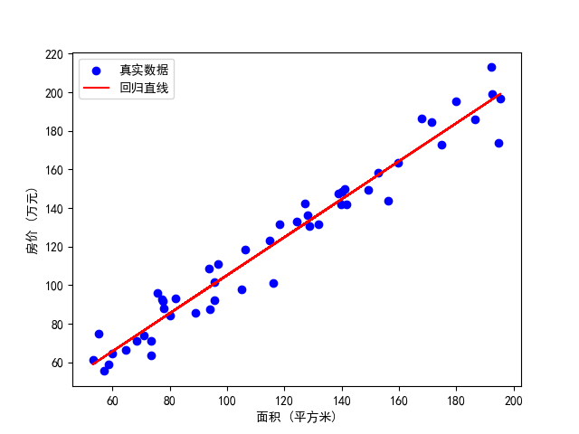

# 单变量线性回归 (Linear Regression with One Variable)

单变量线性回归用于预测一个连续变量（目标）与一个特征（自变量）之间的线性关系。它是机器学习中最基础的回归方法之一，直观且易于理解。

[上一章](./linearRegression.md) --- [下一章](./LinearRegressionWithMultipleVariables.md)

---

这部分结合一个房价随房子大小的[数据集](./dateSet/priceBySize_dataset.csv)来理解，
数据都是又grok生成，类似这样

| 房子大小（sqm）          | 房价（万）       |
|--------------------|-------------|
| 106.18101782710437 | 118.56568362705848 |
| 192.60714596148742 | 199.32082877338712 |
| 159.79909127171078 | 163.64260844782837 |
| 139.7987726295555  | 141.7877356736626 |

## 1. 模型形式

单变量线性回归模型可以表示为：

$$
y = \theta_0 + \theta_1 x + \epsilon
$$

- $x$：自变量（特征）  
- $y$：因变量（目标/标签）  
- $\theta_0$：截距（bias）  
- $\theta_1$：斜率（权重）  
- $\epsilon$：误差项（噪声）  

> **目标**：通过训练找到最佳参数 $\theta_0$ 和 $\theta_1$，
> 使预测值 $\hat{y}$ 尽可能接近真实值 $y$。

通俗解释（结合房价）:
想象你想预测一间房子的价格，房间大小是关键因素。
模型就像一个简单的公式：基础价（$\theta_0$）+ 每平方米价格（$\theta_1$ × 大小）= 预测价。
但现实中，总有些误差（$\epsilon$），可能是装修或位置影响，
我们的目标是调整 $\theta_0$ 和 $\theta_1$，让预测尽量贴近实际卖价。

---

## 2. 代价函数/损失函数（均方误差 MSE）

代价函数和损失函数在*`单变量线性回归`*的语境中通常是同一个概念，二者常互换使用。

> 重点解释： 在线性回归中，代价函数 $ J(\theta_0, \theta_1) $ 
> 指的是整个数据集上预测值与真实值差值的平均度量（例如均方误差 MSE），
> 而损失函数通常指单个样本的误差度量。
> 实际应用中，尤其在优化参数时，常用“代价函数”表示总体的优化目标。

> 具体解释
> 
> 损失函数：
>对于单个样本 $i$，损失函数可以定义为 $$ L(\hat{y}^{(i)}, y^{(i)}) = (\hat{y}^{(i)} - y^{(i)})^2 $$
> 
>其中 $\hat{y}^{(i)} = \theta_0 + \theta_1 x^{(i)}$ 是预测值，$ y^{(i)} $ 是真实值。
>
> 
> 代价函数：
>代价函数是对所有样本损失的平均，公式为：
> $$J(\theta_0, \theta_1) = \frac{1}{2m} \sum_{i=1}^m (\hat{y}^{(i)} - y^{(i)})^2$$
> 这里 $ m $ 是样本总数，$\frac{1}{2m}$ 是归一化因子，$\frac{1}{2}$ 便于导数计算。

用来衡量模型预测误差的常用指标是均方误差（Mean Squared Error, MSE）：

$$
J(\theta_0, \theta_1) = \frac{1}{2m} \sum_{i=1}^m (\hat{y}^{(i)} - y^{(i)})^2
$$

- $m$：样本数  
- $\hat{y}^{(i)} = \theta_0 + \theta_1 x^{(i)}$  

> 我们的目标是最小化代价函数 $J(\theta_0, \theta_1)$，从而找到最优参数。

术语解释:

1.代价函数如何产生？
代价函数是衡量模型“错得有多离谱”的工具。我们希望预测房价 $\hat{y}$ 跟真实房价 $y$ 越接近越好。
差值 $(\hat{y} - y)$ 表示单次错误，但直接用差值有正负抵消问题，
所以取平方 $(\hat{y} - y)^2$，放大误差影响。
再对所有样本求平均（$\frac{1}{m} \sum$），$\frac{1}{2}$ 是数学简化导数计算。

2.如何得到这个函数？
这是统计学和优化理论的结果。均方误差是常见选择，
因为它对大误差敏感，且数学上便于求导，适合线性回归优化。

通俗解释（结合房价）:
你想买房子，预测100平米的房子要120万，但实际卖118万，你就“看走眼”了2万。
为了防止估测高了和低的误差抵消，把差值平方一下（2万）²，这样不管是高估还是低估都算“错估”。

然后，不是一套房子，而是很多房子都预测一遍。把所有的“错”加起来，再求平均，这个数就是 代价函数 
$J$。它就像一个“平均错误分数”。
- 分数大 → 说明预测得很不靠谱。
- 分数小 → 说明预测越来越准。
所以，训练模型的目标就是调整参数（直线的斜率、截距），让这个分数尽量低。

>其中：
> 损失函数就是一套房子的“错估多少”。
> 代价函数就是“所有房子的平均错估多少”

👉 总结一句：代价函数就是“平均错多少”的衡量标准，我们训练就是为了把它压到最低。

> 那么现在的新问题，如何才能将MSE降低到最低；
> 如何才能够自动地找出这些使代价函数 J 取最小值的参数 $\theta_0$ 和 $\theta_1$。也就是下面要降到的梯度下降。

---

## 3. 梯度下降

梯度下降是一种迭代优化算法，用于找到使函数值最小的参数。其核心表达式为：

> $$\theta_j := \theta_j - \alpha \frac{\partial J}{\partial \theta_j}, \quad j=0,1$$

$  \theta_j  $：待优化的参数（如模型中的 $  \theta_0, \theta_1  $）

$  \alpha  $：学习率，控制每次调整的步长

$  \frac{\partial J}{\partial \theta_j}  $：
代价函数 $  J  $ 对参数 $  \theta_j  $ 的偏导数，指示误差变化方向

那么表达式如何得到的呢

1.优化目标： 我们希望最小化代价函数 $  J(\theta_0, \theta_1)  $，这是个多变量函数，
目标是找到 $  \theta_0, \theta_1  $ 使 $  J  $ 最小。

2.梯度概念： 在数学中，函数的梯度（所有偏导数的向量）指向函数值增加最快的方向。
所以这里
$$J(\theta_0, \theta_1) = \frac{1}{2m} \sum_{i=1}^m (\hat{y}^{(i)} - y^{(i)})^2$$
对$\theta_j$求偏导，得到
$$  \frac{\partial J}{\partial \theta_0} = \frac{1}{m} \sum_{i=1}^m (\hat{y}^{(i)} - y^{(i)})  $$
$$  \frac{\partial J}{\partial \theta_1} = \frac{1}{m} \sum_{i=1}^m (\hat{y}^{(i)} - y^{(i)}) x^{(i)}  $$
这些偏导数构成了梯度向量，指示 $J$ 增加最快的方向。
再看一下梯度概念： 
函数的梯度 $[\frac{\partial J}{\partial \theta_0}, \frac{\partial J}{\partial \theta_1}]$ 
指向 $J$ 增加最快的方向。沿负梯度方向移动，$J$ 会下降。

接下来的目标： 每次迭代调整 $\theta_0$ 和 $\theta_1$，使 $J$ 减小

> 通俗解释： 想象下山，要求得的最低值便是到山脚。
> $[\frac{\partial J}{\partial \theta_0}, \frac{\partial J}{\partial \theta_1}]$ 告诉你最快的方向；
> $\frac{\partial J}{\partial \theta_j}$ 告诉你坡度，
> $\alpha$ 像你迈的步子大小。步子太小（$\alpha$ 小），下山慢；
> 步子太大（$\alpha$ 大），可能跳过谷底摔下去。

3.更新公式： 

这里引入一个标量 $\alpha$ 控制步长。$\alpha$ 是学习率，调节调整幅度。

基本更新思路： 参数应朝减少 $J$ 的方向移动，即 $\theta_j$ 减去某个与梯度成正比的量
(即$\alpha \frac{\partial J}{\partial \theta_j}$)。

公式推导：

- 设参数更新为 $\theta_j := \theta_j + \Delta \theta_j$
- 结合前面的基本更新思路，代入更新：
$$\theta_j := \theta_j + (-\alpha \frac{\partial J}{\partial \theta_j})$$

化简，如此得到核心表达式：
$$\theta_j := \theta_j - \alpha \frac{\partial J}{\partial \theta_j}$$

- 适用所有 $\theta_j$： 公式对 $j=0,1$ 通用，故写作 $\theta_j := \theta_j - \alpha \frac{\partial J}{\partial \theta_j}, \quad j=0,1$。

> 这里在[loveunk 的机器学习与深度学习笔记](https://github.com/loveunk/machine-learning-deep-learning-notes)
> 中提到了一个问题：
> 
> 如果我们预先把 $\theta_1$ 放在一个局部的最低点，下一步梯度下降法会怎样工作？
> 
> 首先，由于 $\theta_1$ 已经在最低点了，
> 所以 $  \frac{\partial J}{\partial \theta_1} = 0  $，
> 后续调整量 $  \alpha \frac{\partial J}{\partial \theta_1} = 0  $，
> $  \theta_1  $ 不再更新
> 
> 其次，当前模型（线性回归）的特性： 
> 二次函数的代价函数是凸函数（假设数据无冗余），意味着只有一个全局最低点，
> 所谓局部最低点也就是全局最低点
> 
> 补充：即使数据有冗余（如所有 $x^{(i)}$ 相同），
> $J$ 可能退化为非严格凸，存在平坦区域，但仍无局部最低点，仅影响唯一性。

---

## 4. [Python 示例](./example/trainingUnivariateLinearRegressionModel.py)

采用grok生成的[数据集](./dateSet/priceBySize_dataset.csv)，使用 `scikit-learn` 训练单变量线性回归模型： 

**生成的可视化示意**

    

**生成结果示例：**
> 模型系数（斜率 $b_1$）： 0.9851044002568737
> 
> 模型截距（$b_0$）： 6.711672731845184
> 
> 预测 150 平方米的房价约为 154.48 万元