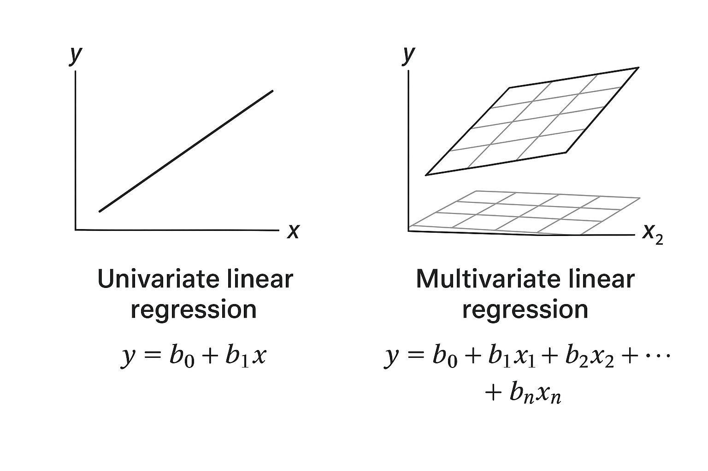

# 线性回归

[上一章](./README.md) --- [下一章](./LinearRegressionWithOneVariable.md)

---

“线性回归（Linear Regression）”这个名称可以拆成两部分理解：

1. **回归（Regression）**  
> 通过已有数据预测因变量与自变量的关系，来源于“回归均值”概念，即变量趋向均值。
2. **线性（Linear）**  
> 假设因变量 $y$ 与自变量 $x$ 呈线性关系，用直线（单变量）或平面/超平面（多变量）表示：

单变量：$ y = b_0 + b_1 x $

多变量：$ y = b_0 + b_1 x_1 + b_2 x_2 + \dots + b_n x_n $

其中 $b_i$ 为回归系数，$\varepsilon$ 为误差项。

**图示版本：**

**总结：**  
线性回归用线性方程预测一个或多个因变量的数值。

## [单变量线性回归 (Linear Regression with One Variable)](./LinearRegressionWithOneVariable.md)

## [多变量线性回归 (Linear Regression with Multiple Variables)](./LinearRegressionWithMultipleVariables.md)

---

## 单变量 vs 多变量线性回归对比

| 方面 | 单变量线性回归 | 多变量线性回归 | 共同点 |
|------|----------------|----------------|--------|
| 自变量数量 | 1 个 | 2 个或以上 | 都属于线性模型 |
| 模型形式 | y = b0 + b1 * x | y = b0 + b1*x1 + b2*x2 + ... + bn*xn | 都假设因变量与自变量线性关系 |
| 目标 | 拟合直线 | 拟合多维平面（超平面） | 都用最小二乘法求参数 |
| 可视化 | 易，可画二维散点图 | 难，高维数据通常用投影展示 | 回归系数可解释自变量对因变量影响 |
| 应用场景 | 单因素影响结果 | 多因素共同影响结果 | 都可用 R²、MSE 等评估拟合效果 |
| 计算复杂度 | 低 | 高 | 参数估计方法一致 |

___
[上一章](./README.md)---[下一章](./LinearRegressionWithOneVariable.md)