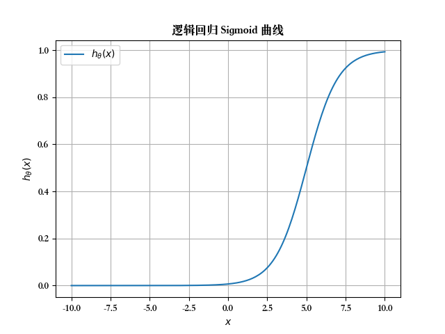
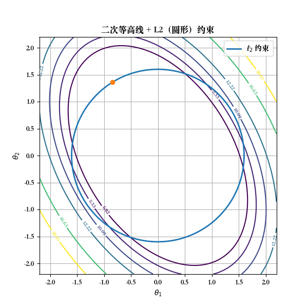
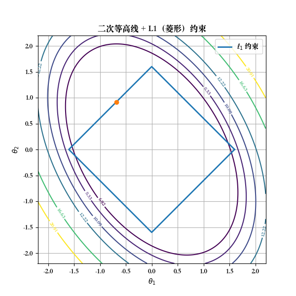

# 逻辑回归

[上一章](./LinearRegressionWithMultipleVariables.md) --- [下一章](./neuralNetworks.md)

---

## 1. 逻辑回归 (Logistic Regression)

逻辑回归是一种用于**二分类问题**的机器学习算法，尽管名字有“回归”，但它实际用于分类。它通过预测概率来判断一个样本属于哪个类别（比如“是”或“不是”）。
逻辑回归 (Logistic Regression) 的算法，这是目前最流行使用最广泛的学习算法之一。

首先介绍几种分类问题：

- 垃圾邮件分类：垃圾邮件（是或不是）？
- 在线交易分类：欺诈性的（是或不是）？
- 肿瘤：恶性 / 良性

先从二元的分类问题开始讨论。将因变量(dependent variable)可能属于的两个类分别称为

负向类（negative class）和
正向类（positive class）
则 因变量 y ∈ { 0,1 } ，其中 0 表示负向类，1 表示正向类。

对于肿瘤分类是否为良性的问题：

对于二分类问题，y 取值为 0 或者1，但如果使用的是线性回归，那么 h 的输出值可能 远大于1，或者远小于。但数据的标签应该取值0 或者1。所以在接下来的要研究一种新算法逻辑回归算法，这个算法的性质是：它的输出值永远在0到 1 之间。

> **逻辑回归与线性回归的区别**
> 
> _为什么线性回归输出可能远大于1或远小于0？_
> 
> 线性回归的假设函数为 $ h(x) = \theta^T x $，输出为连续值，
> 范围为 $(-\infty, +\infty)$。在二分类问题中，标签 $ y \in \{0, 1\} $，但线性回归的输出无边界：
> 当特征 $ x $ 或参数 $ \theta $ 数值较大时，$ h(x) $ 可能远大于1（如10、100）或远小于0（如-5、-100）。
> 
> 这与二分类标签（0或1）不匹配，输出无法直接表示类别或概率。
>
> _为什么逻辑回归输出在0到1之间？_
> 
>逻辑回归使用 Sigmoid函数，定义为 $$ h(x) = \frac{1}{1 + e^{-\theta^T x}} $$，
> 其关键性质： 无论 $ \theta^T x $ 取何值，
> Sigmoid函数将输出压缩到 $(0, 1)$ 区间。 
> 输出可解释为类别1的概率，适合二分类任务。
>
> _**总结**_
>
> 线性回归输出无界，可能远大于1或远小于0，不适合二分类。逻辑回归通过Sigmoid函数确保输出在 $(0, 1)$，更适合二分类问题。
> 
> 逻辑回归算法是分类算法。可能因为算法的名字中出现“回归”让人感到困惑，但逻辑回归算法实际上是一种分类算法，它适用于标签 y 取值离散的情况，如：1 0 0 1。

---

## 2. Hypothesis 表示

> 在机器学习里，**Hypothesis（假设函数)** 就是我们选定的一个函数，用来：
>
> - 接收输入特征 $x$
>
> - 输出一个预测值 $\hat{y}$
>
> 换句话说：
> Hypothesis 就是模型的“预测公式”。
> 
>
> 
**通俗解释**: Hypothesis 是逻辑回归的预测函数，用来输出样本属于某个类别的概率（0到1之间）。它基于线性回归，但通过 Sigmoid 函数将结果压缩到 (0,1)。

**数学公式**:
$$
h_\theta(x) = \frac{1}{1 + e^{-\theta^T x}}
$$
其中：
- $ \theta^T x = \theta_0 + \theta_1 x_1 + \theta_2 x_2 + \dots + \theta_n x_n $ 是线性组合。
- Sigmoid 函数 $ \sigma(z) = \frac{1}{1 + e^{-z}} $ 将任意实数映射到 (0,1)。

**解释**: 如果 $ h_\theta(x) \geq 0.5 $，预测为正类（1）；否则为负类（0）。

**逻辑函数示意图**
<div align="center">
    
</div>

**Python实现：**

```python
import numpy as np
def sigmoid(z):
  return 1 / (1 + np.exp(-z))
```

$h_\theta(x)$ 的作用，给定输入变量，计算输出变量 = 1的可能性（estimated probability），即 $ h_\theta(x) = P(y=1 | x;θ) $。

- 例如对一个肿瘤的样本，计算得到 $h_\theta(x) = 0.7$，也就是有70%的可能是恶性的。

---

## 3. 边界判定 (Decision Boundary)

如果 $h_\theta(x)=0.8$，模型的意思就是：

> 在输入 $x$ 的情况下，预测它属于 类别 1 的概率是 80%。

同样：

- $h_\theta(x)=0.2$ → 预测它属于 类别 1 的概率是 20%，也就是说更可能是 类别 0。

- 当 $h_\theta(x)=0.5$ → 模型最不确定，正好是 50/50。

边界判定是逻辑回归用来区分不同类别的“分界线”。它由 $ \theta^T x = 0 $ 定义，决定了样本属于哪个类别。

**数学公式**:
$$
\theta^T x = 0
$$
- 当 $ \theta^T x > 0 $，$ h_\theta(x) > 0.5 $，预测为正类。
- 当 $ \theta^T x < 0 $，$ h_\theta(x) < 0.5 $，预测为负类。

**解释**: 边界可以是直线（线性）或曲线（非线性，加入高次项）。

---

## 4. 代价函数 (Cost Function)

逻辑回归：输出是概率（在 $[0,1]$），而目标 $y \in {0,1}$。
如果我们硬套平方误差，会有两个大问题：

- 函数不是凸函数 → 梯度下降可能卡在局部最小值，不好优化。
- 误差意义不大 → 分类问题更关心“概率是否接近真实类别”，而不是数值差几分。

所以逻辑回归换了一种思路：
把 概率模型 转成 最大似然估计（MLE），然后得到一个新的代价函数：

**数学公式**:
$$
J(\theta) = -\frac{1}{m} \sum_{i=1}^m \left[ y^{(i)} \log(h_\theta(x^{(i)})) + (1 - y^{(i)}) \log(1 - h_\theta(x^{(i)})) \right]
$$
这就是逻辑回归的 交叉熵代价函数，其中：
- $ m $: 样本数。
- $ y^{(i)} $: 真实标签（0或1）。
- $ h_\theta(x^{(i)}) $: 预测概率。

> - 预测对了 → 代价接近 0。
>
> - 预测错了 → 代价急速变大。
>
> 用 log 的好处是：对错误的惩罚增长得非常快，逼着模型调整参数。

**解释**: 如果预测概率接近真实标签，代价小；否则代价大。

---

## 5. 梯度下降算法 (Gradient Descent)

**数学公式**:
$$
\theta_j := \theta_j - \alpha \frac{\partial J(\theta)}{\partial \theta_j}
$$
其中：
- $ \alpha $: 学习率（步长）。
- $ \frac{\partial J(\theta)}{\partial \theta_j} $: 代价函数对 $ \theta_j $ 的偏导数。

---

## 6. 多类别分类：一对多 (One-vs-Rest)

 一对多是处理多类别分类的方法。假设有 $ K $ 个类别，
 就训练 $ K $ 个二分类逻辑回归模型，每个模型区分“某个类别”与“其他所有类别”。

> 如果我们有 3 个类别（$a, b, c$）：
>
> - 建立一个分类器来判 a vs 非a
> - 建立一个分类器来判 b vs 非b
> - 建立一个分类器来判 c vs 非c
> 
> 这样我们就训练了 3 个二分类模型。

**数学公式**:
- 对每个类别 $ k $，训练一个逻辑回归模型：
$$
h_\theta^k(x) = P(y = k | x; \theta)
$$
- 预测时，选择概率最高的类别：
$$
\hat{y} = \arg\max_k h_\theta^k(x)
$$

> 举个例子：
>假如 $x$ 经过计算得到：
>
> - $h_\theta^{(a)}(x) = 0.2$
>
> - $h_\theta^{(b)}(x) = 0.7$
>
> - $h_\theta^{(c)}(x) = 0.1$
>
>那么我们就预测 类别 b。

---

## 7. 正则化 (Regularization)

正则化是为了防止模型过于复杂（过拟合），通过在代价函数中加入惩罚项，限制参数 $ \theta $ 的大小。
给模型一个“惩罚”，让它不要把参数 $\theta$ 调得太极端。

**数学公式（其中 $ \lambda $ 是正则化强度）**:
### L2 正则化（Ridge）：
$$
J(\theta) = J(\theta)_{\text{原}} + \frac{\lambda}{2} \sum_{j=1}^n \theta_j^2
$$
- 惩罚参数平方
- 让 $\theta_j$ 趋向于小，但一般不会变成 0
- 效果：模型“平滑”，但保留所有特征

### L1 正则化（Lasso）：
$$
J(\theta) = J(\theta)_{\text{原}} + \lambda \sum_{j=1}^n |\theta_j|
$$

- 惩罚参数绝对值 
- 会把一些 $\theta_j$ 直接压到 0 
- 效果：相当于自动做“特征选择”，只留下重要的特征

> - Ridge = 让模型不过于复杂，但保留所有特征；
> - Lasso = 还能“删掉”没用的特征，得到稀疏模型。
> 
> **解释**: L2 使参数变小但不归零，L1 可能使某些参数为零（特征选择）。

下面是二次等高线 + L2（圆形）约束、二次等高线 + L1（菱形）约束。
从图上能直观看到：
椭圆等高线与圆相切的点通常不在坐标轴上，而与菱形相切更容易“卡在尖角”（即某一维为 $0$），
这就是 L1 促稀疏、L2 不易稀疏的几何原因。
图上 外围的一圈圈椭圆线，就是 代价函数（Cost function）的等高线。
<div style="display: flex; justify-content: center; gap: 20px;">
  
  
</div>

### 1. L2 正则（圆形约束）

- 圆圈表示允许的参数范围：
$ \theta_1^2 + \theta_2^2 \leq r^2 $

- 椭圆和圆相切的地方，通常落在“圆的边缘”，不会刚好在坐标轴上。
👉 所以参数都变小，但不容易精确等于 $0$。

### 2. L1 正则（菱形约束）

- 菱形表示允许的参数范围：
$ |\theta_1| + |\theta_2| \leq r $

- 菱形有尖角，尖角刚好在坐标轴上（例如 $(\theta_1=0, \theta_2=某值)$）。

- 椭圆和菱形最容易相切在尖角处。
👉 所以某些参数会被直接压到 $0$。
---
[上一章](./LinearRegressionWithMultipleVariables.md) --- [下一章](./neuralNetworks.md)
