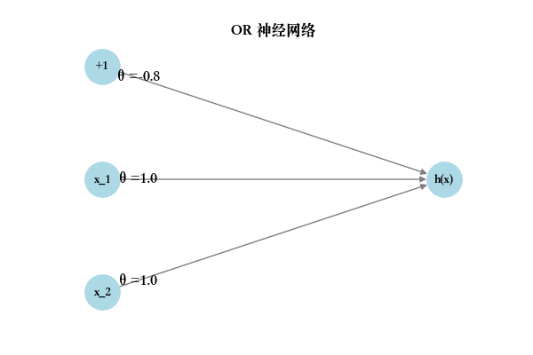
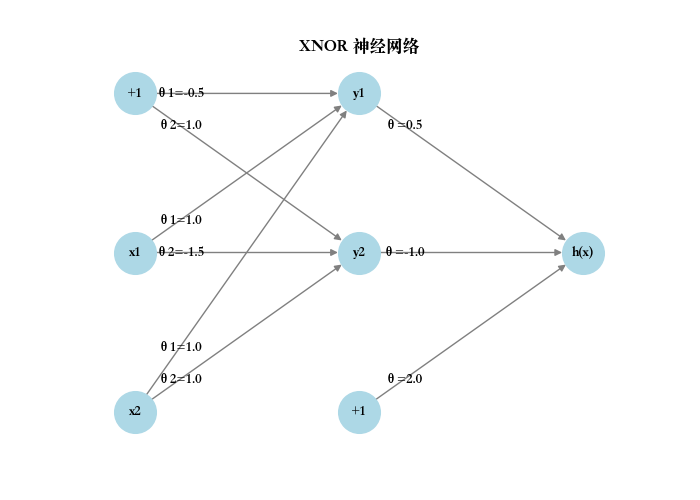
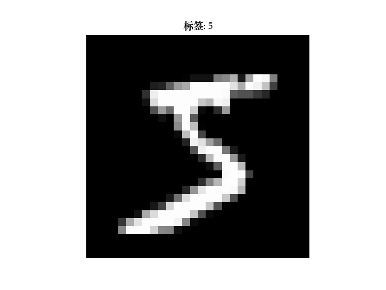

# 神经网络

[上一章](5.logisticRegression.md)

---

## 背景介绍

1. 背景 & 动机

### 为什么需要神经网络:
逻辑回归可以解决二分类，但遇到复杂问题（非线性边界、图像识别、语音识别），逻辑回归力不从心。
神经网络能自动学习复杂的非线性映射。

### 神经元和大脑类比:
- 生物神经元有输入（树突）、处理（胞体）、输出（轴突）。
- 人工神经元模仿它：加权求和 → 激活函数 → 输出。

---

## 模型表示

在逻辑回归中，本质上是画一条直线（高维时是超平面），来把 正类 vs 负类 分开。
所以逻辑回归只能直接做 二分类 或者通过 一对多 组合做多分类。
👉 它的本质还是：一次判断 YES / NO。

而神经网络是在逻辑回归的基础上更加深入，
它对比逻辑回归就是，从a与非a的判断的基础上，a之后再b非b，非a后面在c非c，这样不断下去，
并且后续的判断会在前次的基础上更深层次，有一定的关联。
逻辑回归就是神经网络的每个神经元。总结一句话：逻辑回归是单神经元，神经网络是多神经元、层叠组合的复杂结构。

> 直观类比
>- 逻辑回归：老师只看一眼作业，说“对/不对”。
>- 神经网络：老师先看你字迹（第一层），再看你公式（第二层），再看你思路（第三层），最后才下结论。

神经网络在逻辑回归的基础上，通过多层神经元（节点）的组合，构建更复杂的决策过程：

- 多层结构：输入经过多层处理，每层包含多个神经元，每一层提取更高层次的特征。
- 非线性激活：每层神经元不仅做线性组合 $\mathbf{w}^T\mathbf{x} + b$，还通过非线性激活函数（如 ReLU、sigmoid、tanh）引入非线性，使模型能处理复杂模式。
$  h^{(l)} = f(\mathbf{W}^{(l)}h^{(l-1)} + \mathbf{b}^{(l)})  $
其中，$h^{(l)}$ 是第 $l$ 层的输出，$f$ 是激活函数，$h^{(l-1)}$ 是前一层的输入。
- 层间关联：每一层的输出是下一层的输入，层层递进，逐步提取更抽象的特征。

直观理解：逻辑回归只看“表面”（一次线性判断），而神经网络像“层层剖析”，从低级特征（字迹）到高级特征（思路），逐步做出综合判断。

神经网络模型建立在很多神经元之上，每一个神经元又是一个个学习模型。
这些 **神经元（也叫激活单元，activation unit** 采纳一些特征作为输出，并且根据本身的模型提供一个输出。
在神经网络中，参数又可被称为权重（weight）。

> 神经网络的核心思想是：通过多层“神经元”（逻辑单元）把输入映射到输出，每一层都做非线性变换。
数学上，一个神经网络可以表示为：
$$
\mathbf{a}^{[l]} = f( \mathbf{W}^{[l]} \mathbf{a}^{[l-1]} + \mathbf{b}^{[l]} )
$$
>- $\mathbf{a}^{[l]}$：第$l$层的输出（激活值）
>- $\mathbf{W}^{[l]}$：第$l$层权重矩阵
>- $\mathbf{b}^{[l]}$：第$l$层偏置向量——
> 偏置向量（bias vector）是神经网络中每一层神经元的额外可学习参数，它不依赖输入，用来调节激活函数的输出。
> 相当于在逻辑回归里判定边界的平移量
>- $f$：非线性激活函数（如sigmoid, ReLU等）
>- 第0层$\mathbf{a}^{[0]}$就是输入特征$x$

---

## 神经网络前向传播

<div style="display: flex; justify-content: center; gap: 20px;">
&nbsp;&nbsp;
</div>

### 1. 神经网络结构

考虑一个三层神经网络：

- **输入层**：4 个节点（$x_0, x_1, x_2, x_3$，其中 $x_0=1$ 为偏置项）。
- **隐藏层**：3 个神经元（$a_1^{(2)}, a_2^{(2)}, a_3^{(2)}$，输出包含偏置项 $a_0^{(2)}=1$）。
- **输出层**：1 个神经元（$h_\theta(x)$，例如二分类问题的概率输出）。

### 2. 符号定义

- $a_i^{(j)}$：第 $j$ 层第 $i$ 个神经元的激活值，$a_0^{(j)}=1$ 为偏置单元。
- $\theta^{(j)}$：从第 $j$ 层到第 $j+1$ 层的权重矩阵，维度为 (第 $j+1$ 层神经元数) $\times$ (第 $j$ 层神经元数 + 1)。
- $z^{(j)}$：第 $j$ 层的线性输入，$z^{(j)} = \theta^{(j-1)} a^{(j-1)}$（单样本，含偏置）。
- $X$：输入数据，单样本为 $X \in \mathbb{R}^{(n+1) \times 1}$（含偏置），训练集为 $X \in \mathbb{R}^{m \times (n+1)}$（$m$ 个样本，$n+1$ 个特征）。
- $g(\cdot)$：激活函数（如 sigmoid、ReLU、softmax，输出层根据任务选择）。

### 3. 单样本前向传播

#### (1) 隐藏层计算

对于单样本输入 $X = [x_0, x_1, x_2, x_3]^T \in \mathbb{R}^{4 \times 1}$（$x_0=1$ 为偏置项），隐藏层有 3 个神经元，计算如下：
$$
z_1^{(2)} = \theta_{10}^{(1)} x_0 + \theta_{11}^{(1)} x_1 + \theta_{12}^{(1)} x_2 + \theta_{13}^{(1)} x_3, \quad a_1^{(2)} = g(z_1^{(2)})
$$

$$
z_2^{(2)} = \theta_{20}^{(1)} x_0 + \theta_{21}^{(1)} x_1 + \theta_{22}^{(1)} x_2 + \theta_{23}^{(1)} x_3, \quad a_2^{(2)} = g(z_2^{(2)})
$$

$$
z_3^{(2)} = \theta_{30}^{(1)} x_0 + \theta_{31}^{(1)} x_1 + \theta_{32}^{(1)} x_2 + \theta_{33}^{(1)} x_3, \quad a_3^{(2)} = g(z_3^{(2)})
$$

**矩阵形式**：
权重矩阵 $\theta^{(1)} \in \mathbb{R}^{3 \times 4}$：
$$
\theta^{(1)} = \begin{bmatrix}
\theta_{10}^{(1)} & \theta_{11}^{(1)} & \theta_{12}^{(1)} & \theta_{13}^{(1)} \\
\theta_{20}^{(1)} & \theta_{21}^{(1)} & \theta_{22}^{(1)} & \theta_{23}^{(1)} \\
\theta_{30}^{(1)} & \theta_{31}^{(1)} & \theta_{32}^{(1)} & \theta_{33}^{(1)}
\end{bmatrix}
$$
线性输入：
$$
z^{(2)} = \theta^{(1)} X \in \mathbb{R}^{3 \times 1}, \quad a^{(2)} = g(z^{(2)}) = [a_1^{(2)}, a_2^{(2)}, a_3^{(2)}]^T
$$
其中，$g$ 逐元素应用（例如，$g(z) = \frac{1}{1 + e^{-z}}$ 为 sigmoid）。

#### (2) 输出层计算

隐藏层激活（含偏置）：$a^{(2)} = [a_0^{(2)}, a_1^{(2)}, a_2^{(2)}, a_3^{(2)}]^T \in \mathbb{R}^{4 \times 1}$，$a_0^{(2)}=1$。
权重矩阵：$\theta^{(2)} = [\theta_{10}^{(2)}, \theta_{11}^{(2)}, \theta_{12}^{(2)}, \theta_{13}^{(2)}] \in \mathbb{R}^{1 \times 4}$。
输出：
$$
z^{(3)} = \theta_{10}^{(2)} a_0^{(2)} + \theta_{11}^{(2)} a_1^{(2)} + \theta_{12}^{(2)} a_2^{(2)} + \theta_{13}^{(2)} a_3^{(2)}
$$

$$
h_\theta(x) = g(z^{(3)})
$$

**矩阵形式**：
$$
z^{(3)} = \theta^{(2)} a^{(2)} \in \mathbb{R}, \quad h_\theta(x) = g(z^{(3)})
$$
对于二分类，$g$ 通常为 sigmoid；对于多分类，$g$ 为 softmax。

### 4. 训练集向量化

对于训练集（$m$ 个样本），输入矩阵 $X \in \mathbb{R}^{m \times 4}$，每行一个样本（含偏置 $x_0^{(i)}=1$）：
$$
X = \begin{bmatrix}
x_0^{(1)} & x_1^{(1)} & x_2^{(1)} & x_3^{(1)} \\
x_0^{(2)} & x_1^{(2)} & x_2^{(2)} & x_3^{(2)} \\
\vdots & \vdots & \vdots & \vdots \\
x_0^{(m)} & x_1^{(m)} & x_2^{(m)} & x_3^{(m)}
\end{bmatrix}
$$

**隐藏层**：
$$
Z^{(2)} = X \theta^{(1)T} \in \mathbb{R}^{m \times 3}, \quad A^{(2)} = g(Z^{(2)})
$$
其中，$\theta^{(1)T} \in \mathbb{R}^{4 \times 3}$，$A^{(2)} \in \mathbb{R}^{m \times 3}$ 是 $m$ 个样本的隐藏层激活。

**输出层**：
为每个样本添加隐藏层偏置项，构造 $A^{(2)} = [1, A^{(2)}] \in \mathbb{R}^{m \times 4}$（在每行前添加 1），然后：
$$
Z^{(3)} = A^{(2)} \theta^{(2)T} \in \mathbb{R}^{m \times 1}, \quad H_\theta(X) = g(Z^{(3)})
$$

向量化计算避免了循环，提高了效率。

### 5. 前向传播总结

前向传播的步骤如下：

1. **输入层**：$A^{(1)} = X$，单样本 $X \in \mathbb{R}^{4 \times 1}$（含偏置），多样本 $X \in \mathbb{R}^{m \times 4}$。
2. **隐藏层**：
   - 单样本：$z^{(2)} = \theta^{(1)} A^{(1)}$，$a^{(2)} = g(z^{(2)})$。
   - 多样本：$Z^{(2)} = X \theta^{(1)T}$，$A^{(2)} = g(Z^{(2)})$。
3. **输出层**：
   - 单样本：$z^{(3)} = \theta^{(2)} a^{(2)}$，$h_\theta(x) = g(z^{(3)})$。
   - 多样本：$Z^{(3)} = A^{(2)} \theta^{(2)T}$，$H_\theta(X) = g(Z^{(3)})$。

**注**：

- 偏置项通过 $x_0=1$ 和 $a_0^{(2)}=1$ 融入权重矩阵计算，简化公式。
- 激活函数 $g$ 根据任务选择，例如 sigmoid 用于二分类，softmax 用于多分类。

---

## 神经网络应用

神经网络中，单层神经元（无中间层）的计算可用来表示逻辑运算，比如逻辑与(AND)、逻辑或(OR)。

将一个逻辑单元（神经元）这样表示：
$$
h_{\theta}(x) = g( \theta_0 + \theta_1 x_1 + \theta_2 x_2 )
$$

这里：

- $g(z)$ 是激活函数，常见选择是 sigmoid： $g(z) = \frac{1}{1+e^{-z}}$。

- $x_1, x_2$ 是输入（0 或 1）。

- $\theta$ 是参数（权重+偏置），通过学习来决定。

### _逻辑与（AND）_
真值表

|$x_1$|$x_2$| $h_{\theta}(x)$  |
|---|---|------------------|
|0|0|0|
|0|1|0|
|1|1|1|
|1|0|0|

> 如果我们要让神经元$(h_{\theta}(x) = g( \theta_0 + \theta_1 x_1 + \theta_2 x_2 )）$实现 AND 运算， $\theta_0, \theta_1, \theta_2$ 应该满足什么特点？
> 
> 只有当 $x_1=1, x_2=1$ 时，输出接近 1，其他情况输出接近 0。
> 先假设 $ \theta_0 = 0，\theta_1 = 0.5，\theta_2 = 0.5 $
> - 当 $(x_1, x_2)=(1,1)$： （还不错，接近 1）
> - 当 $(x_1, x_2)=(1,0)$ 或 $(0,1)$： （这离 0 有点远）
> - 当 $(x_1, x_2)=(0,0)$： （完全没达到想要的 0）
> 
> 👉 所以问题在哪？——主要是 偏置太小。sigmoid 在 0 的时候会输出 0.5，而不是接近 0。
> 要实现 AND，通常要 把阈值设高一点：让单个输入不足以超过阈值，必须两个输入一起才行。
>
> 比如：
>  $ \theta_0 = -0.8，\theta_1 = 1，\theta_2 = 1 $
> 
> 这样：
> <div style="display: flex; justify-content: center; gap: 20px;">
> &nbsp;&nbsp;
> </div>
>
> - (1,1): $z= -0.8 + 1+1 = 1.2 \to g(1.2)\approx 0.77 \approx 1$
> - (1,0): $z= -0.8 + 1 = 0.2 \to g(0.2)\approx 0.55$ （更接近 0）
> - (0,0): $z=-0.8 \to g(-0.8)\approx 0.31 \approx 0$

### _逻辑或(or)_
真值表

|$x_1$|$x_2$| $h_{\theta}(x)$ |
|---|---|-----------------|
|0|0| 0               |
|0|1| 1               |
|1|1| 1               |
|1|0| 1               |

> 如果我们要让神经元$(h_{\theta}(x) = g( \theta_0 + \theta_1 x_1 + \theta_2 x_2 )）$实现 OR 运算， $\theta_0, \theta_1, \theta_2$ 应该满足什么特点？
> 
> 比如：
>  $ \theta_0 = -0.8，\theta_1 = 1，\theta_2 = 1 $
> 
>这样：
> <div style="display: flex; justify-content: center; gap: 20px;">
> &nbsp;&nbsp;
> </div>
>
> - (1,0): $z = 0.5 \to g(0.5)\approx 0.62$ 
> - (0,1): 同样 $0.62$
> - (1,1): $z = 1.5 \to g(1.5)\approx 0.82$
> - (0,0): $z=-0.5 \to g(-0.5)\approx 0.38$

用单个神经元可以做 AND / OR，那 XOR（异或）/ XNOR(同或) 能不能用单个神经元表示？

单个神经元的形式是：$ h_{\theta}(x) = g( \theta_0 + \theta_1 x_1 + \theta_2 x_2 ) $,
这个是一个线性分类器，本质上是“画一条直线”把 0 和 1 分开。
但是 XOR 的分布是什么样的呢？
- 正例 (1)：在 (0,1) 和 (1,0)
- 负例 (0)：在 (0,0) 和 (1,1)
画一下就能发现：这两个正例在对角线，负例在另一条对角线。

👉 它们不是用一条直线能分开的，而是线性不可分。

所以，不管你怎么调 $\theta_0,\theta_1,\theta_2$，单个神经元是做不到 XOR 的（XNOR同理）。

### _异或(XOR)_
真值表

|$x_1$|$x_2$| $h_{\theta}(x)$ |
|---|---|-----------------|
|0|0| 0               |
|0|1| 1               |
|1|1| 0               |
|1|0| 1               |
> 如果我们要让神经元实现 XOR 运算，需要两层，输入层到隐藏层两个神经元，隐藏层到输出层需要一个神经元，涉及到 $\theta$ 应该满足什么特点？
> 
> 比如：
> - 输入层到隐藏层y1 $ \theta_0 = 0.5，\theta_1 = 1.0，\theta_2 = 1.0 $
> - 输入层到隐藏层y2 $ \theta_0 = 1.0，\theta_1 = 1.5，\theta_2 = 1.0 $
> - 隐藏层到输出层h(x)：$ \theta_0 = 2.0，\theta_1 = 0.5，\theta_2 = -1.0 $
> 
> 这样：
> <div style="display: flex; justify-content: center; gap: 20px;">
> &nbsp;&nbsp;
> </div>

### _同或(XNOR)_
真值表

|$x_1$|$x_2$| $h_{\theta}(x)$ |
|---|---|-----------------|
|0|0| 1               |
|0|1| 0               |
|1|1| 1               |
|1|0| 0               |

> 如果我们要让神经元实现 XNOR 运算， 涉及到 $\theta$ 应该满足什么特点？
> 
> 比如：
> - 输入层到隐藏层y1：$ \theta_0 = 0.5，\theta_1 = 1.0，\theta_2 = 1.0 $
> - 输入层到隐藏层y2：$ \theta_0 = 1.0，\theta_1 = -1.5，\theta_2 = 1.0 $
> - 隐藏层到输出层h(x)：$ \theta_0 = 2.0，\theta_1 = 0.5，\theta_2 = -1.0 $
> 这样：
> <div style="display: flex; justify-content: center; gap: 20px;">
> &nbsp;&nbsp;
> </div>

---

## 反向传播

当神经网络很浅（1~2层）时，训练其实很简单，直接计算损失对每个权重的导数就能用梯度下降更新权重。但是，当网络变深（多层隐藏层）时，会遇到参数过多、计算重复、梯度传播困难等问题。

但是采用链式法则将复杂问题拆分、再从输出层反向计算梯度（并复用中间的结果）变可以得到更高效的训练方法

### 代价函数

一些符号计法： 
> 
> - 假设神经网络的训练样本有 m 个
> - 每个包含一组输入 x 和一组输出信号 y
> - L 表示神经网络层数
> - $S_I$ 表示每层的神经元个数（ $S_I$ 表示输出层神经元个数）
> - $S_L$ 代表最后一层中处理单元的个数
> 
> 将神经网络的分类定义为两种情况：二类分类和多类分类，
> - 二类分类：$S_L = 1$，输出 $y \in {0,1}$，使用 $sigmoid$ 激活函数
> - 多类分类：$S_L = K$，输出 $y$ 为 $one-hot$ 向量，使用 $softmax$ 激活函数


神经网络代价函数的思想还是和逻辑回归代价函数是一样的，
希望通过代价函数来观察算法预测的结果与真实情况的误差有多大，
唯一不同的是，对于每一行特征，我们都会给出 $K$ 个预测，
基本上我们可以利用循环，对每一行特征都预测 $K$ 个不同结果，
然后在利用循环在 $K$ 个预测中选择可能性最高的一个，将其与 $y$ 中的实际数据进行比较。

逻辑回归中，代价函数是
$$
J(\theta) = -\frac{1}{m} \sum_{i=1}^m \left[ y^{(i)} \log(h_\theta(x^{(i)})) + (1 - y^{(i)}) \log(1 - h_\theta(x^{(i)})) \right]
$$
在逻辑回归中，我们只有一个输出变量，又称标量（scalar），
也只有一个因变量 $y$ ，但是在神经网络中，我们可以有很多输出变量，
我们的 $h_θ(x)$ 是一个维度为 $K$ 的向量，
并且我们训练集中的因变量也是同样维度的一个向量，因此我们的代价函数会比逻辑回归更加复杂一些， 为： 

$
h_\theta\left(x\right)\in \mathbb{R}^{K} {\left({h_\theta}\left(x\right)\right)}_{i}={i}^{th} \text{output}
$
$$
\begin{align*}
J(\Theta) = &-\frac{1}{m} \sum_{i=1}^m \sum_{k=1}^K \left[ y_k^{(i)} \log \left( h_\Theta \left( x^{(i)} \right) \right)_k + \left( 1 - y_k^{(i)} \right) \log \left( 1 - \left( h_\Theta \left( x^{(i)} \right) \right)_k \right) \right] \\
&+ \frac{\lambda}{2m} \sum_{l=1}^{L-1} \sum_{i=1}^{s_l} \sum_{j=1}^{s_{l+1}} \left( \Theta_{ji}^{(l)} \right)^2
\end{align*}
$$

解释：

第一部分（双重求和）

- 外层求和：遍历每个样本 $i$
- 内层求和：遍历每个输出节点 $k$
本质上就是对逻辑回归的代价函数做了 向量化扩展，每个输出节点都有自己的**交叉熵损失**(衡量 预测概率分布与真实分布差异 的函数)。

第二部分（正则化）

- 遍历每一层权重矩阵$\theta^{(l)}$，对每个权重平方求和
- 防止过拟合
- $\lambda$是正则化强度

> 所以可以理解为：神经网络的代价函数是多输出逻辑回归的推广，并加上了正则化。

之前我们在计算神经网络预测结果的时候我们采用了一种正向传播方法，
我们从第一层开始正向一层一层进行计算，直到最后一层的 $h_θ(x)$ 。
现在，为了计算代价函数的偏导数
$ \frac{\partial}{\partial\Theta^{(l)}_{ij}}J\left(\Theta\right)$ ，
我们需要采用一种反向传播算法，也就是首先计算最后一层的误差，
然后再一层一层反向求出各层的误差，直到倒数第二层。

### 梯度检验
对一个复杂的模型（例如神经网络）使用梯度下降算法时，可能会存在不容易察觉的错误。
就是说，虽然代价函数（Cost function）看上去在不断减小，但最终的结果可能并不是最优解。

为了避免这样的问题，我们采取一种叫做梯度的数值检验（Numerical Gradient Checking）方法。
这种方法的思想是通过估计梯度值来检验我们计算的导数值是否符合预期。

对梯度的估计采用的方法是在代价函数上沿着切线的方向选择离两个非常近的点，
然后计算两个点的平均值用以估计梯度。即对于某个特定的 $\theta$ ，
我们计算出在 $\theta - \epsilon$ 处和 $\theta + \epsilon$ 的代价值
（ $\epsilon$ 是一个非常小的值，通常选取0.001），
然后求两个代价的平均，用以估计在 $\theta$ 处的代价值。

为了避免反向传播实现错误，可以使用**数值梯度检验**：

$$
\frac{\partial J}{\partial \theta} \approx \frac{J(\theta + \epsilon) - J(\theta - \epsilon)}{2\epsilon}
$$

> 注意：请在开始训练你的模型之前，把梯度检验禁用掉，因为它非常耗时！

### MNIST数据集训练0-9的数字识别

后续基于[CSV 格式的 MNIST 的 Kaggle 数据集](dataSet/mnist_train_100.csv)
训练手写数字识别模型学习；展示一下第一个数据转换为图片效果
```python
import pandas as pd
import matplotlib.pyplot as plt
import numpy as np

# 设置中文字体，避免乱码
plt.rcParams['font.sans-serif'] = ['Songti SC']
plt.rcParams['axes.unicode_minus'] = False

# 读取 CSV 文件
df = pd.read_csv("mnist_train_100.csv", header=None)

# 取第一行
first_row = df.iloc[0]

# 第一个值是标签
label = int(first_row[0])

# 后面 784 个值是像素
pixels = np.array(first_row[1:], dtype=np.uint8).reshape(28, 28)

# 显示图片
plt.imshow(pixels, cmap='gray')
plt.title(f"标签: {label}")
plt.axis('off')
plt.show()
```

展示效果图：
<div style="display: flex; justify-content: center; gap: 20px;">
&nbsp;&nbsp;
</div>

### 接下来是对数字识别的模型训练

[代码](./example/mnist_nn.py)
由于训练数据只有100条所以准确率不理想，这主要学习一下代码编写

---
[上一章](5.logisticRegression.md)